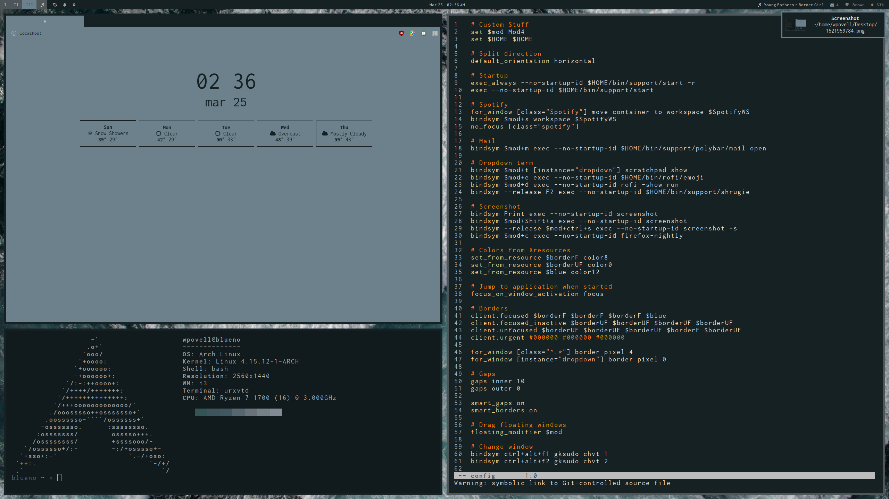

# dotfiles

This repo holds my dotfiles & various other things for my desktop and laptop.

The general structure is

- `*.theme/`: A theme usable by `retheme`
  - `.wallpaper`: Wallpaper
  - `.theme`: Color definitions
- `archived/`: Old themes I don't use anymore
- `main/`: Pretty much everything that gets linked, mostly self-explanatory
  - `.config/`: Where all my config files are
  - `bin/`: Scripts I've made and found useful
    - `color/`: Color test scripts
    - `rofi/`: Rofi prompts bound to shortcuts
    - `support/`: Things not on my path but used by i3/polybar
- `packages/`: Backup of all the packages on each machine
- `root/`: Mirrors the structure of `/`, holds machine-wide configuration files
- `misc/`: Resources and various odds and ends

Notably `main` and themes are managed by [`stow`](https://www.gnu.org/software/stow/).
